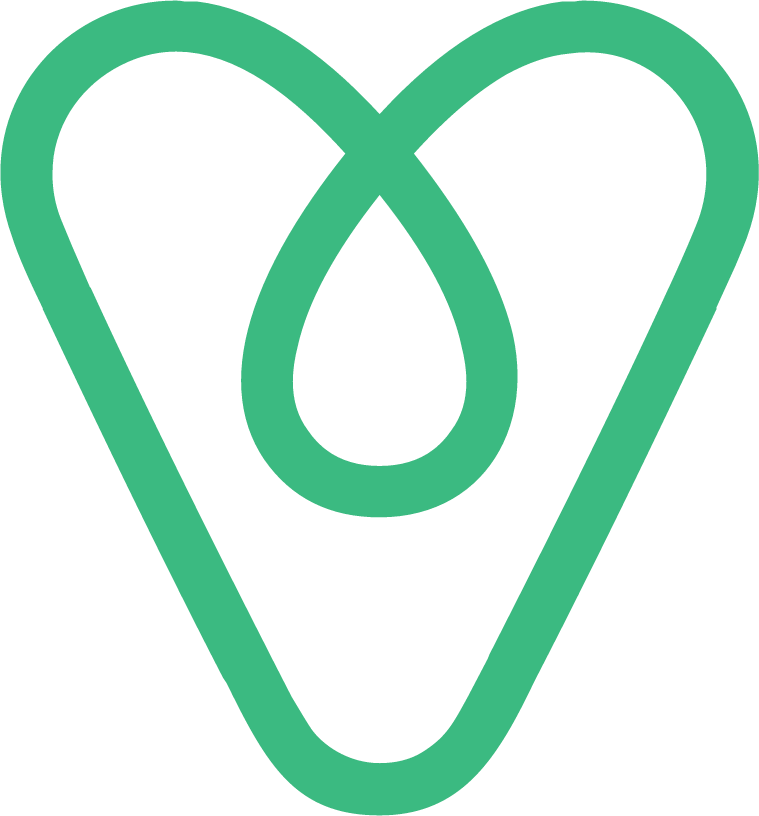

<p align="center">
  <a href="" rel="noopener">
 </a>
</p>

<h3 align="center">VueBnb</h3>

<div align="center">

  []() 
  
  [](https://github.com/kylelobo/The-Documentation-Compendium/pulls)

</div>

---

<p align="center"> Vuebnb: Full-Stack Vue.js and Laravel App.
    <br> 
</p>

## 📝 Table of Contents
- [About](#about)
- [Getting Started](#getting_started)
- [Built Using](#built_using)
- [Credits](#credits)

## 🧐 About <a name = "about"></a>
Vuebnb, a simple clone of Airbnb.

## 🏁 Getting Started <a name = "getting_started"></a>
These instructions will get you a copy of the project up and running on your local machine for development.

### Prerequisites
Clone the repository

```
git clone https://github.com/vcjpierre/fullstack-laravel-vuejs.git
```

```
cd fullstack-laravel-vuejs
```


### Installation
Install all dependencies

```
composer install
npm install
```

Create your DB and put your environments variables in the file `.env`

Then run migrations and seeders

```
php artisan migrate
php artisan db:seed
```

## ⛏️ Built Using <a name = "built_using"></a>
- [Laravel](https://laravel.com//) - PHP Framework
- [VueJs](https://vuejs.org/) - Web Framework


## 🎉 Credits <a name = "credits"></a>
- https://vuejsdevelopers.com/2017/11/20/vuebnb-full-stack-laravel/
